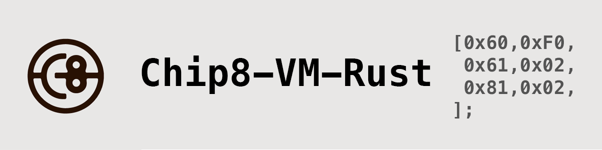

# chip8-vm-rust

## Build status:
 

 ## Introduction

An SDL2-based interpreter for the Chip-8 programming language, written in Rust. Compatible with all standard games and programs, it provides a seamless experience for Chip-8 enthusiasts and developers alike.

## Features
- **Cross-Platform Compatibility**: Written in Rust, this interpreter can be compiled and run on various platforms.
- **Graphics Rendering**: With a defined video buffer, it's capable of rendering Chip-8 graphics with ease.
- **ROM File Support**: Load and execute Chip-8 ROM files.
- **Extensive Instruction Set**: Supports a wide range of Chip-8 instructions for a comprehensive emulation experience.
- **Memory Management**: Efficiently manages the 4KB of RAM available to the Chip-8.

## Components
- **CPU**: Handles the main operations related to the Chip-8 VM, including interpreting instructions and managing the execution flow.
- **GPU**: Manages graphics rendering and operations for the Chip-8 display.
- **Memory**: Manages memory operations, providing an interface for reading and writing to the Chip-8's 4KB RAM.
- **Instructions**: Defines the various opcodes and their associated operations.

## Getting Started
1. Clone the repository.
2. Compile and run using the Rust toolchain.
3. Load your favorite Chip-8 ROM and enjoy!

## License
Open-source under the MIT license.

## Contributing
Feel free to fork, make improvements, and submit PRs. All contributions are welcome!
