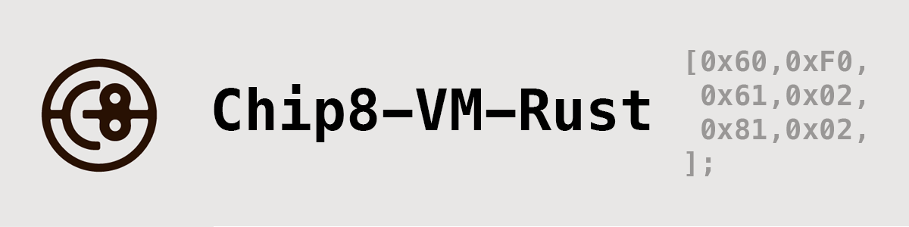

# chip8-vm-rust
[](https://github.com/ivanscorral/chip8-vm-rust/actions/workflows/rust.yml)



## Introduction

`chip8-vm-rust` is an advanced implementation of the Chip-8 interpreter, crafted with precision in Rust. Leveraging the SDL2 framework, it ensures seamless compatibility with standard Chip-8 games and programs, making it a top choice for both enthusiasts and developers.

## Technical Overview

## `chip8` Module

The `chip8` module serves as the core engine of the interpreter, handling the primary functionalities:

### CPU
Handles the interpreter's computational tasks and interacts with graphics functionalities for sprite rendering.

### GPU
Responsible for rendering the Chip-8 graphics and ensuring the display is accurate and responsive.

### Instructions
Defines the Chip-8 opcodes, making sure each command is interpreted and executed correctly.

### Memory
Manages the Chip-8's 4KB RAM, ensuring efficient read and write operations.

### Main Loop
Acts as the primary control mechanism, driving the execution flow of the interpreter. This component is especially valuable for debugging, allowing for testing without the need for the `sdl` front-end.


## `sdl` Module: The Front-End Interface

The `sdl` module, integral to the `chip8-vm-rust` project, provides a dynamic and interactive interface, bridging the gap between the user and the Chip-8 virtual machine's core functionalities.

### Keyboard Input Management

The module's architecture is designed to efficiently capture and process keyboard input, seamlessly translating it into actionable commands for the Chip-8's 16-key keypad. The implementation leverages the SDL2 framework's event handling mechanism:

- **ESC Key/Window Close Actions**: These user interactions trigger termination protocols, ensuring a graceful shutdown of the interpreter.
- **SPACE Key**: A toggle mechanism in the CPU's state management system responds to this key, allowing users to halt or resume the instruction execution flow.
- **M Key**: Invoking the `cpu.cycle()` method, this key provides users with granular control, enabling them to advance the CPU by a single cycle.
- **P Key**: Activates the `cpu.print_registers()` function, offering users a snapshot of the CPU's current register states.
- **Return/Enter Key**: Resets the CPU, clearing registers, memory, and reinitializing the program counter.
- **Chip-8 Keypad Mapping**: A comprehensive key-to-function mapping system ensures that key presses correlate directly with the `cpu.key_pressed(index)` function, guaranteeing precise and responsive input handling.

### Display Rendering Mechanics

Display operations in the `sdl` module are optimized for performance and clarity:

- **Resolution Management**: The module employs an upscale algorithm to adapt the Chip-8's native 64x32-pixel display to modern resolutions, as defined by the `WINDOW_WIDTH` and `WINDOW_HEIGHT` constants.
    - **Upscaling Algorithm**:
        ```rust
        let upscale_ratio = WINDOW_WIDTH / gpu::VRAM_WIDTH
        ```
    - **Aspect Ratio**: The absence of built-in aspect ratio checks mandates careful selection of the upscale factor to prevent visual distortions.

### Main Execution Loop Dynamics

The module's main loop is meticulously structured to ensure synchronization between video rendering and CPU instruction execution:

- **Video Rendering Loop**: A timer-driven mechanism, controlled by the `REFRESH_RATE` constant, manages display refresh cycles, ensuring smooth visual output.
- **CPU Execution Loop**: Operating in tandem with the video rendering loop, this component processes Chip-8 instructions based on the `CPU_CLOCK_HZ` constant.
    - **Clock Speed**: The design defaults to a 500 Hz clock speed, reflecting the original Chip-8 interpreter's specifications.
    - **Cycles Calculation**:
        ```rust
        let cycles_per_frame = CPU_CLOCK_HZ / REFRESH_RATE
        ```
        This formula typically deduces an average of 8 cycles per frame, considering a default setting of 500 Hz and 60 FPS.


## Features

The `chip8-vm-rust` project is a straightforward Chip-8 interpreter, offering core functionalities:

### Cross-Platform Capability
Thanks to Rust, the interpreter is designed to run on various platforms without platform-specific adjustments.

### Graphics Rendering
The `gpu.rs` file manages the rendering of Chip-8 graphics, ensuring accurate display of sprites and pixels.

### ROM File Support
The interpreter supports loading and executing standard Chip-8 ROM files, catering to a wide range of games and programs.

### Instruction Set
The `instructions.rs` file details the Chip-8 opcodes, enabling the interpreter to handle the complete range of Chip-8 commands.

### Memory Management
Memory operations are handled in the `memory.rs` file, efficiently managing the Chip-8's 4KB RAM.


## Getting Started

Follow these steps to set up and run the `chip8-vm-rust` interpreter:

### Pre-requisites: Installing SDL2

Depending on your operating system, follow the appropriate instructions to install SDL2:

- **WSL (Windows Subsystem for Linux)**
    1. Update your packages: `sudo apt update && sudo apt upgrade`
    2. Install SDL2: `sudo apt install libsdl2-dev`

- **MacOS (using Homebrew)**
    1. If you haven't installed Homebrew, get it from [here](https://brew.sh/).
    2. Install SDL2: `brew install sdl2`

- **Linux**
    1. Update your packages: `sudo apt update`
    2. Install SDL2: `sudo apt install libsdl2-dev`

### Setting Up the Interpreter

1. Clone the repository: `git clone https://github.com/ivanscorral/chip8-vm-rust.git`
2. Navigate to the project directory: `cd chip8-vm-rust`
3. Compile and run using the Rust toolchain: `cargo run`
4. Load your preferred Chip-8 ROM and experience the emulation!


## License

Open-source under the MIT license.

